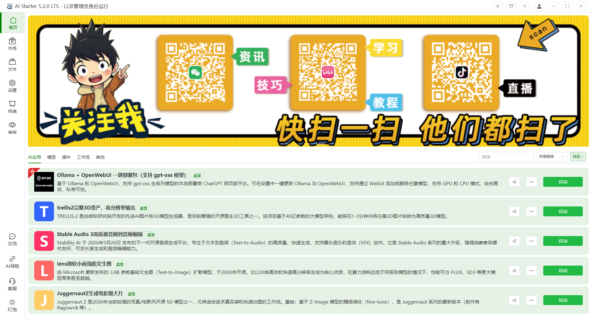
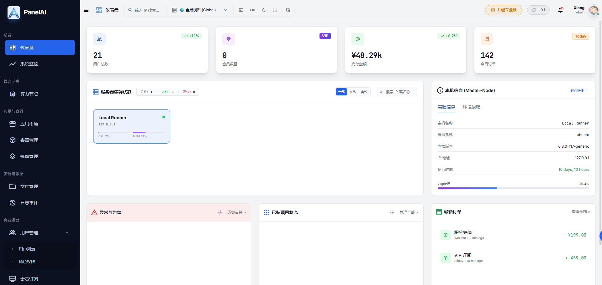

# AIStarter (Legacy Edition) 经典留存版

**🎉 AIStarter 经典留存版已正式开源**

本仓库用于整理 AIStarter 早期阶段的经典版本源码与依赖结构，全量移交并面向开发者社区开放，用于学习、研究与二次开发。

随着产品演进，该版本已完成其历史使命，并作为关键技术阶段的留存版本持续开放。



---

## 🚀 启动科技 AI 生态演进

在持续推进 AI 基础设施与桌面端技术演进的过程中，启动科技的下一代产品矩阵已全面展开：

- ⚡ **PanelAI（Beta）**
  面向 AI 时代的服务器面板与基础设施平台，提供极简的模型私有化部署与运行环境管理，并深度聚焦 CPU/GPU 算力调度、AI 项目运营与算力变现，打通从“技术基建”到“商业收益”的完整闭环。  
  https://www.panelai.cn

- 🛠️ **下一代 AIStarter 架构重构**
  基于经典版本的历史运行反馈，下一代 AIStarter 将采用全新的技术路线与架构规划，推进底层重构与工程体系统一（统一架构、统一语言、尽可能统一），并在跨平台运行效率、环境隔离与可维护性上实现跃迁。



---

## 🌍 官方矩阵

- AIStarter 官网（国内）：https://www.starter.top
- AIStarter 官网（国际）：https://www.starter.one
- PanelAI 官网：https://www.panelai.cn
- 启动科技官网：https://www.qidong.ai

---

## 📖 项目概述

AIStarter Legacy Edition 是 AIStarter 早期阶段的重要技术基石，提供完整的桌面端 AI 项目管理与运行能力，包括：

- AI 项目安装与管理
- 自动化运行环境处理
- 启动脚本与任务编排
- 本地化 AI 工具集成能力

本版本以开源形式独立存在，便于极客与开发者学习与研究。随着技术的不断演进，后续新版本将采用全新的技术路线与架构规划，与当前留存版保持不同的演进方向。

---

## 🛠️ 模块与技术栈

项目采用多模块分离结构：

- **Desktop（桌面客户端）**
  Electron + Vue 3 + Vite + Element Plus + Pinia + Vue Router

- **Admin（管理后台）**
  Vue 3 + Vite + Ant Design Vue + Pinia + Vue Router

- **Server（服务端核心）**
  Node.js + Express + MySQL + WebSocket

完整依赖清单请参考根目录下的 [DEPENDENCIES.md](./DEPENDENCIES.md)。

---

## 💻 快速开始

本项目为多模块架构，请分别进入对应目录安装与运行各子系统。

### 1) 克隆项目

```bash
git clone https://github.com/aihubpro/.aistarter.git
cd .aistarter
```

### 2) 安装依赖（各模块独立安装）

```bash
# 桌面客户端 (Desktop)
cd aistarter-client
npm install

# 管理后台 (Admin)
cd ../aistarter-server/frontend
npm install

# 服务端 (Server)
cd ../aistarter-server/backend
npm install
```

### 3) 环境变量配置

请在各服务端/客户端目录下复制环境配置模板并填入您的真实参数：

```bash
cp .env.example .env
```

Windows PowerShell 可使用：

```powershell
Copy-Item .env.example .env
```

### 4) 本地运行

```bash
# 启动桌面端
cd aistarter-client
npm run dev

# 启动管理后台
cd ../aistarter-server/frontend
npm run dev

# 启动服务端
cd ../aistarter-server/backend
npm run dev
```

### 5) 客户端打包构建

```bash
cd aistarter-client
npm run build
```

---

## ⚖️ 合规与免责声明

- 开源协议：本项目采用 Apache License 2.0 发布，详情请见仓库根目录的 `LICENSE` 文件。
- 第三方依赖：本项目使用的第三方框架、组件与 SDK 等，其版权与许可均归原作者/组织所有。核心第三方组件声明请见 [THIRD-PARTY-NOTICES.md](./THIRD-PARTY-NOTICES.md)。二次分发与商业部署前，请自行核对合规要求。
- 商标与品牌：AIStarter、PanelAI 及 启动科技 等名称、Logo 与相关品牌权益均归属官方所有。基于本项目进行 Fork 或衍生开发时，请移除官方品牌标识，避免任何误导性宣传或官方关联暗示。
- 风险提示（AS IS）：本项目按“现状”提供。在生产环境使用前，请自行完成安全评估、依赖升级与漏洞修复。因使用、部署及二次开发本项目产生的任何合规、数据、技术故障与第三方授权纠纷，均由使用者自行承担，官方不提供相关担保。

---

## 🙌 致敬开源

AIStarter Legacy Edition 作为历史版本的积累，将继续作为开源技术资产存在。未来的技术演进将围绕更现代化的工程体系持续推进，期待与更多开发者在 AI 时代的软件生态中相遇。
